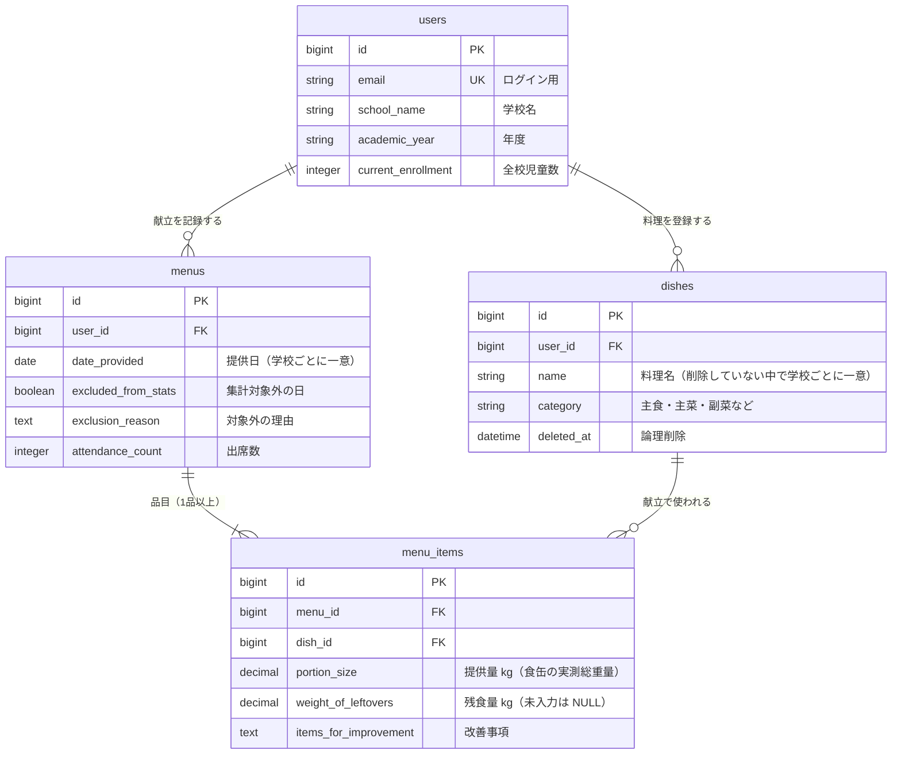

# 残食ノート

> 学校給食の栄養士が、測って終わりになっている残食記録を、料理ごとに蓄積・比較して次の献立に活かせるようにするアプリ

## 公開URL

https://leftover-note.onrender.com

デモ用アカウント（デモデータ入り）
- メールアドレス: `demo@example.com`
- パスワード: `demo-password`

※ 無料プランのため、最初の表示に 1 分ほどかかることがあります。

## スクリーンショット

【ここに画像を貼る: 献立詳細 / 料理詳細（日ごとの棒グラフ）/ 分析シート】

## 作った背景・課題

### きっかけ

前職の保育園では、その日のメニューがどれだけ残ったかを目視で確認し、「◯△×」で日誌に書く運用がありました。職員の感覚で記録されるため、実際の量や根拠が記録として残りません。以降の献立作成でその記録をもとにどう改善すべきか分からず、徐々に振り返ることがなくなり、日誌の意味が薄れていきました。

たとえば同じ鶏肉でも、煮る・揚げる・蒸すで食感が変わり、残食にも違いが出ることは感じていました。しかし計量はしておらず、原因も先生方や子どもたちの声を栄養士が覚えておくしかありませんでした。

残食は「捨てた量」であると同時に、「子どもが必要な栄養を摂れなかった量」でもあります。この記録を「使える記録」にしたいと思ったのが、このアプリを作ったきっかけです。

### なぜ保育園ではなく学校給食か

保育園では、離乳食から幼児食まで、年齢によって献立の内容そのものが分かれています。そのため、全量をまとめて測っても、何に対する残食率なのかを定義できません。振り返れば、当時の「◯△×」の記録は、測る基準がなかったことの結果だったと思っています。

一方、小学校の給食は、学年によって盛り付ける量に違いはあっても、全校で同じ献立を提供しています。そのため、全校の残食量を合算しても「その日の献立がどれだけ残ったか」として、残食率を定義できます。

さらに、小学校は児童の人数が多く、栄養士が毎日すべての教室を回って声を聞くことは難しいです。だからこそ、定義できる数字として記録し、今後の献立に活かす意味が大きいと考えました。

## 対象と前提

- 学校給食（昼食1回）の残食記録
- 1ユーザー＝1校（1校固定で使う）
- 提供量は、食缶の実測総重量（kg）を入力する
- 残食率 ＝ 合計残食量 ÷ 合計提供量（品目ごとの率の平均ではない）

## このアプリがしないこと

- **残食の原因（量が多すぎたのか、味付けが合わなかったのか）は判断しません。**
  記録しているのは提供量と残食量、つまり重さだけで、理由の情報は持っていないからです。
- 原因を考えるのは栄養士の仕事です。このアプリの役割は、**「考えるべき料理はどれか」を示すところまで**です。
- そのかわり、残食が多かったときの状況や改善事項を品目ごとに文章で残せます。料理詳細で過去の記録と並べて読めるので、原因を考える材料になります。

## 主な機能

- ユーザー認証（Devise）・学校情報の登録
- 料理マスタ（主食・主菜・副菜などの区分つき）
  - 献立で使った料理は削除できない（過去の記録を守るため）
  - 使っていない料理は論理削除（一覧から消し、同じ名前で登録し直せる）
- 献立の登録と、品目ごとの提供量・残食量の記録
- 学級閉鎖などの日を「集計対象外」にできる（理由つき）
- 献立一覧を、期間と料理で絞り込み
- 献立フォームで、同じ料理の前回の記録と改善事項を表示
- 料理詳細: 提供日ごとの残食率を棒グラフで比較
- 分析シート: 今年度に残食率が高い上位5品／年度ごとの平均残食率

## 使用技術

- Ruby 3.4 / Rails 8.1
- PostgreSQL
- Hotwire（Turbo / Stimulus）
- Devise（認証）
- RSpec / FactoryBot（テスト）・RuboCop・GitHub Actions（CI）
- Render（デプロイ）
- グラフはライブラリを使わず、HTML/CSS（div の幅）で描画

## ER図



## 設計の選定理由・工夫した点

### 利用者の声を受けて、グラフを置き換えた

計画では全体の残食率の推移グラフを作る予定でした。管理栄養士の知り合いに公開版を触ってもらうと、「数値だけだと、次に出した時に比較がしづらい。定番メニューを比較できるグラフがあると嬉しい」という声がありました。声は「料理ごとに比べたい」だったので、全体の推移グラフは作らず、料理ごとに提供日の残食率を並べるグラフに置き換えました。利用者の声（困りごと）と自分の対応案は Issue に分けて書き、あとで「声は合っていたが、対応がずれた」と振り返れるようにしています。

### 残食率は「合計残食量 ÷ 合計提供量」にそろえた

品目ごとの率を平均する方法もありますが、自治体の報告書や文部科学省の調査などでは、全体量ベースの計算が公式な指標として使われています。単純平均だと、提供量の違いによる誤差を正しく評価できません。その日の平均・料理別ランキング・年度平均のすべてで同じ定義を使い、画面によって数字がずれないようにしました。

## 今後の改善予定

### MVP であえて入れなかった機能と理由

- 学年別・料理区分別の集計
  最初は現場の作業負担を理由に全校合算にしましたが、実際の計量はクラス単位だと気づき、学年別でも作業負担はあまり変わらない可能性があると開発途中で感じてきました。しかし、まずは全校の残食率を出す最低限の機能を完成させ、次の改善として学年別の表示を追加する予定です。料理区分別は、まず料理ごとの集計を使ってもらい、必要かどうかを見てから決めることにしました。
- 複数ユーザーと権限管理
  MVP では「1ユーザー＝1校」とし、まず1人の栄養士が記録を続けられるかを確かめることを優先しました。同じ学校の複数人で使う場合は、学校とユーザーを分けて権限を付ける予定です。
- CSV・Excel 出力
  まずは記録と比較（料理ごと・年度ごと）をアプリの中で完結させることを優先しました。報告書に数字を転記する手間を減らすため、出力は次の改善で追加したいと考えています。
- 栄養価計算
  このアプリの目的は残食を記録して次の献立に活かすことで、栄養価の計算は目的の外にあるため入れませんでした。
- PWA（オフライン入力）
  MVP では通常の Web アプリとして作りました。計量する場所でネットにつながらない場合に備え、オフラインでも入力できる形は次の改善の候補にしたいと考えています。
- 予定食数の記録
  提供量は食缶の実測総重量で記録するため、残食率を出すのに予定食数は必要ないと考えました。1人あたりの残食量を出すときに必要になるので、そのときに追加する予定です。
- 牛乳の残食記録
  牛乳は食缶ではなくパックで返却されるため、食缶を量る今の記録方法とは量り方が違います。まずは食缶で量れる料理に絞りました。

## ローカルでの動かし方

```bash
git clone https://github.com/choki-code/leftover_note.git
cd leftover_note
bundle install
bin/rails db:setup   # DB 作成＋デモデータ投入
bin/rails s
```

http://localhost:3000 を開き、上のデモ用アカウントでログインする。

テスト: `bundle exec rspec` ／ Lint: `bundle exec rubocop`

## 開発の進め方

- Issue を切る → ブランチ → PR → CI が緑 → マージ。`main` に直接コミットしない
- ブランチ名は `feature/<issue番号>-<短い英語>`（例：`feature/12-meal-search`）。修正は `fix/…`
- コミットは意味のある単位で細かく。メッセージは「何をした」が分かる日本語
- PR には「何を・なぜ・どう確認したか」を書く（`.github/pull_request_template.md`）
